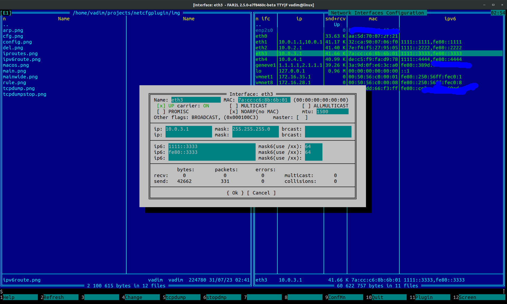
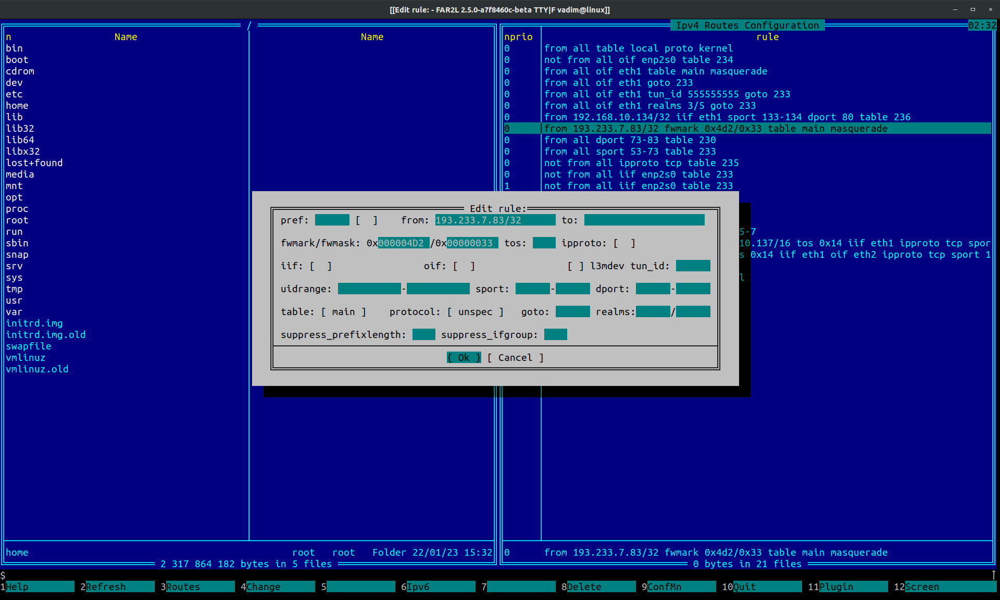
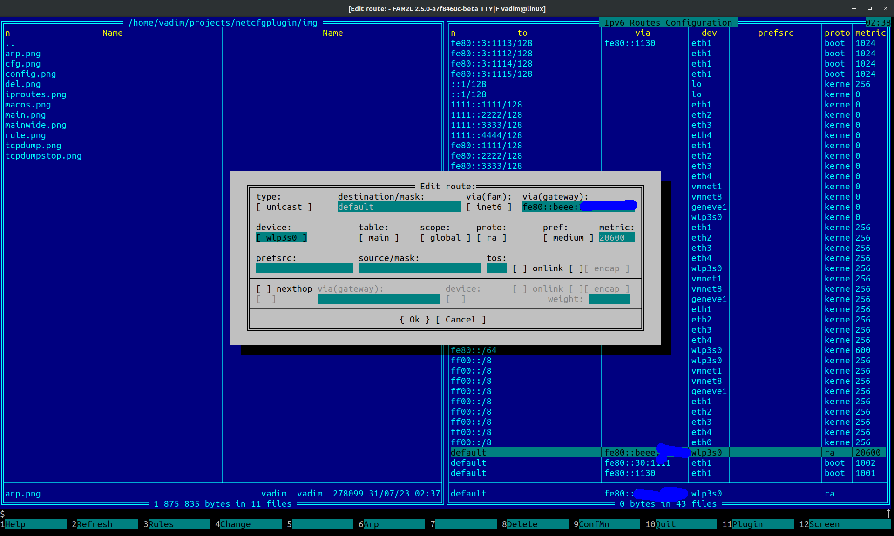
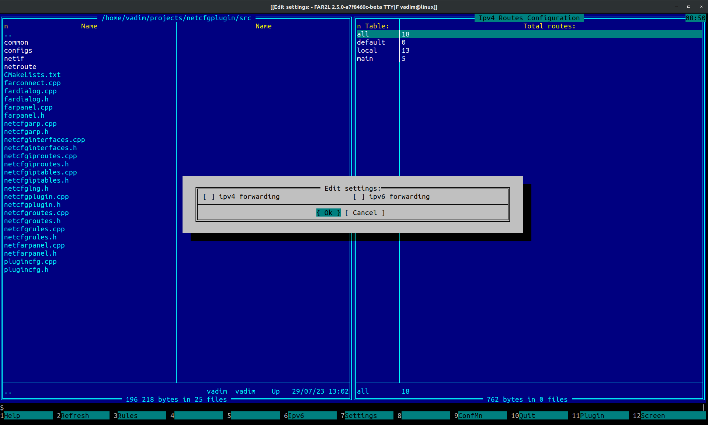
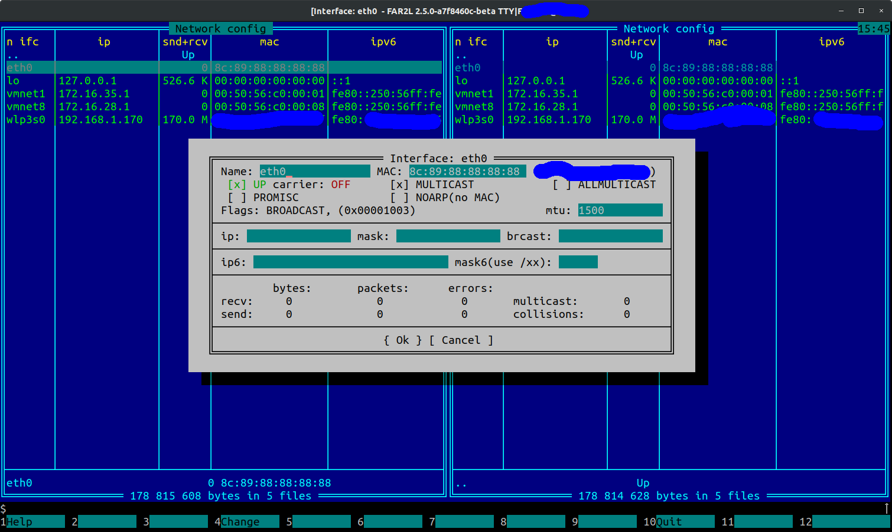

# netcfgplugin

Плагин позволяет (linux и macos):
 * просматривать, редактировать информацию о сетевых интерфейсах, а так же сохранять трафик на интерфейсе в файл (tcpdump)
 * просматривать, создавать, редактировать и удалять информацию о маршрутизации arp, ipv4(ipv6) + multicast
   * в linux (получение информации по netlink, изменение - используя команду ip):
      * маршруты разбиты по таблицам маршрутизации
      * можно просматривать, создавать, редактировать и удалять сетевые правила
      * просмотр multicast маршрутизации
   * в macos (получение информации ioctl, изменение route, ifconfig, arp, npd)

По сборке, просили - скриптик:
```sh
#!/bin/sh
# PWD_PATH задать можно самому - это путь куда клонировали netcfgplugin
git clone --recursive --depth=1 https://github.com/VPROFi/netcfgplugin.git
cd netcfgplugin
PWD_PATH=`pwd`
BUILD_PATH=/tmp/_build
if ! `mount | grep -q $BUILD_PATH`; then
    mkdir -p $BUILD_PATH
    echo mount tmpfs 2Gb at: $BUILD_PATH
    sudo mount tmpfs -o size=2G -o uid=`id -u` -o gid=`id -g` -t tmpfs $BUILD_PATH
fi

# скорее всего прийдется пакеты поднастроить - это зависимости far2m, а не плагина см https://github.com/elfmz/far2m#required-dependencies
libxerces=$(apt search libxerces-c 2>/dev/null | grep -o "^libxerces-c[0-9]\.[0-9]\/" | cut -d"/" -f1)
libwxgtk_dev=$(apt search libwxgtk3.0- 2>/dev/null | grep -o "^libwxgtk3.0-.*dev\/" | cut -d"/" -f1)
libwxgtk=$(apt search libwxgtk3.0- 2>/dev/null | grep -v "^.*dev/" | grep -v "^.*dbgsym" | grep -o '^libwxgtk3.0-[^//]*')

#libxerces='libxerces-c3.2'
#libwxgtk_dev='libwxgtk3.0-gtk3-dev'
#libwxgtk='libwxgtk3.0-gtk3-0v5'

echo use: $libxerces, $libwxgtk_dev, $libwxgtk

sudo apt -y install $libxerces $libwxgtk_dev $libwxgtk libuchardet-dev libspdlog-dev libxerces-c-dev gawk m4 libffi-dev cmake g++

PYTHON_INCLUDE_DIRS=$(python3 -c "from distutils.sysconfig import get_python_inc; print(get_python_inc())")
PYTHON_LIBRARY=$(python3 -c "import distutils.sysconfig as sysconfig; import os; print(os.path.join(sysconfig.get_config_var('LIBDIR'), sysconfig.get_config_var('LDLIBRARY')))")

cd $BUILD_PATH
cmake -DUSEUCD=OFF -DPYTHON3=python3 -DPYTHON_EXECUTABLE=python3 -DPYTHON_INCLUDE_DIRS=$PYTHON_INCLUDE_DIRS -DPYTHON_LIBRARY=$PYTHON_LIBRARY -DCMAKE_INSTALL_PREFIX="/home/$USER/far2m" -DUSEWX=yes -DPYTHON=yes -DPACKAGE_DEPENDENCIES="$libxerces" -DCMAKE_BUILD_TYPE=Release "$PWD_PATH"
make -j$(nproc --all)
make -j$(nproc --all) install
/home/$USER/far2m/bin/far2m 
```

The plugin allows (linux and macos):
  * view and edit information about network interfaces (linux and macos), and use tcpdump on interface
  * view, create, edit and delete routing information arp, ipv4(ipv6) + multicast
    * in linux (getting information via netlink, changing - using the ip command):
       * routes broken down by routing tables
       * you can view, create, edit and delete network rules
       * view multicast routing
    * on macos (getting ioctl information, changing route, ifconfig, arp, npd)

far2m net interfaces configuration plugin.

Build instruction like far2m (https://github.com/VPROFi/far2m)

If your want build inside other version far2m - put content ./src into ./far2m/netcfg and add to ./far2m/CMakeLists.txt add_subdirectory (netcfg)














